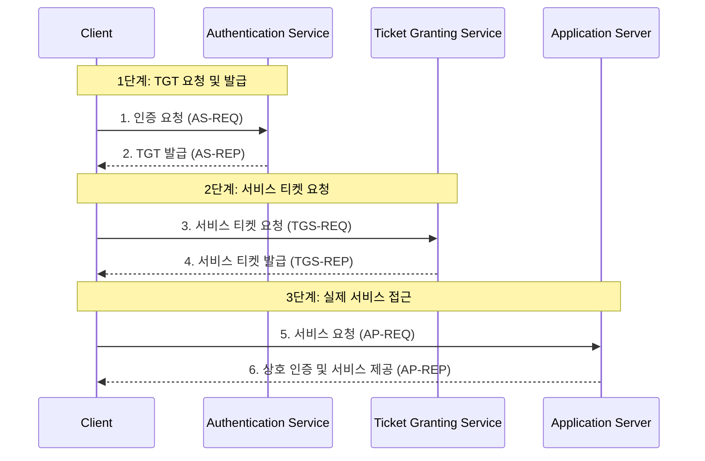

커버로스(Kerberos)는 개방된 네트워크 내에서 서비스 요청자와 서비스 제공자 간의 신원을 안전하게 인증하기 위해 설계된 **네트워크 인증 프로토콜**입니다. 1980년대 MIT의 Athena 프로젝트의 일환으로 개발되었으며, 오늘날 Microsoft Active Directory를 비롯한 수많은 엔터프라이즈 환경의 표준 인증 방식으로 자리 잡고 있습니다.

---
## 1. 커버로스의 핵심 개념

커버로스는 그리스 신화에 등장하는 머리 세 개 달린 개에서 이름을 따왔습니다. 이는 인증의 세 가지 핵심 주체인 **클라이언트**, **서버**, 그리고 이들을 중재하는 **신뢰할 수 있는 제3자(KDC)** 를 상징합니다.

### 주요 용어

- **Principal (주체):** 인증을 받는 고유한 대상(사용자 또는 서비스).
    
- **KDC (Key Distribution Center):** 모든 주체의 암호 키를 관리하고 인증을 처리하는 중앙 기관입니다.
    
    - **AS (Authentication Service):** 사용자의 초기 로그인을 확인하고 TGT를 발급합니다.
        
    - **TGS (Ticket Granting Service):** 사용자가 특정 서비스에 접근할 수 있는 티켓을 발급합니다.
        
- **TGT (Ticket Granting Ticket):** "티켓을 받기 위한 티켓"입니다. 사용자가 매번 암호를 입력하지 않고도 다른 서비스 티켓을 요청할 수 있게 해주는 권한 증명서입니다.
    

---

## 2. 인증 워크플로우 (6단계)

커버로스 인증은 사용자가 암호를 직접 서버에 보내지 않고, 암호화된 티켓을 교환하는 방식으로 진행됩니다.

코드 스니펫

### 상세 절차

1. **AS-REQ:** 클라이언트가 자신의 ID를 KDC의 AS에게 보냅니다.
    
2. **AS-REP:** AS는 클라이언트의 암호로 암호화된 **TGT**를 전달합니다. 클라이언트는 자신의 암호로 이를 복호화하여 저장합니다.
    
3. **TGS-REQ:** 특정 서버(예: DB)에 접근하고 싶을 때, 클라이언트는 TGT를 TGS에게 제시합니다.
    
4. **TGS-REP:** TGS는 확인 후 해당 서버 전용 **서비스 티켓(Service Ticket)**을 발급합니다.
    
5. **AP-REQ:** 클라이언트는 획득한 서비스 티켓을 실제 어플리케이션 서버에 전달합니다.
    
6. **AP-REP:** 서버는 티켓을 확인하고 사용자를 승인합니다. (필요 시 서버도 자신을 인증하는 상호 인증을 수행합니다.)
    

---

## 3. 커버로스의 장점과 단점

|**구분**|**내용**|
|---|---|
|**장점**|**보안성:** 네트워크상에서 암호가 평문으로 전송되지 않습니다.      **상호 인증:** 클라이언트뿐 아니라 서버의 신원도 확인할 수 있습니다.      **싱글 사인온(SSO):** 한 번의 로그인으로 여러 서비스에 접근 가능합니다.|
|**단점**|**KDC 의존성:** 중앙 KDC 서버가 다운되면 전체 인증 시스템이 마비됩니다.      **시간 동기화:** 티켓의 유효 기간 검증을 위해 모든 장비의 시간이 정확히 일치해야 합니다.      **관리 복잡성:** 설정과 관리가 까다롭습니다.|

---

## 4. 요약 및 결론

커버로스는 **대칭 키 암호화** 방식을 기반으로, 신뢰할 수 있는 제3자(KDC)를 통해 네트워크상의 주체들을 안전하게 연결합니다. 오늘날 클라우드 환경에서는 OAuth 2.0이나 SAML이 많이 쓰이지만, **사내 망 인프라나 Hadoop 같은 빅데이터 클러스터**에서는 여전히 커버로스가 가장 강력하고 표준적인 보안 계층으로 사용되고 있습니다.

> **주의:** 커버로스는 "인증(Authentication)"을 담당하는 프로토콜입니다. 사용자가 무엇을 할 수 있는지 결정하는 "인가(Authorization)"는 보통 커버로스 티켓 내의 특수 필드(PAC 등)나 별도의 시스템을 통해 이루어집니다.

---

커버로스 인증 방식의 핵심인 **TGT와 서비스 티켓의 차이점**에 대해 더 구체적으로 알고 싶으신가요? 아니면 **Active Directory에서의 실제 구현 사례**가 궁금하신가요? 구체적인 니즈를 말씀해 주시면 상세히 설명해 드릴 수 있습니다.